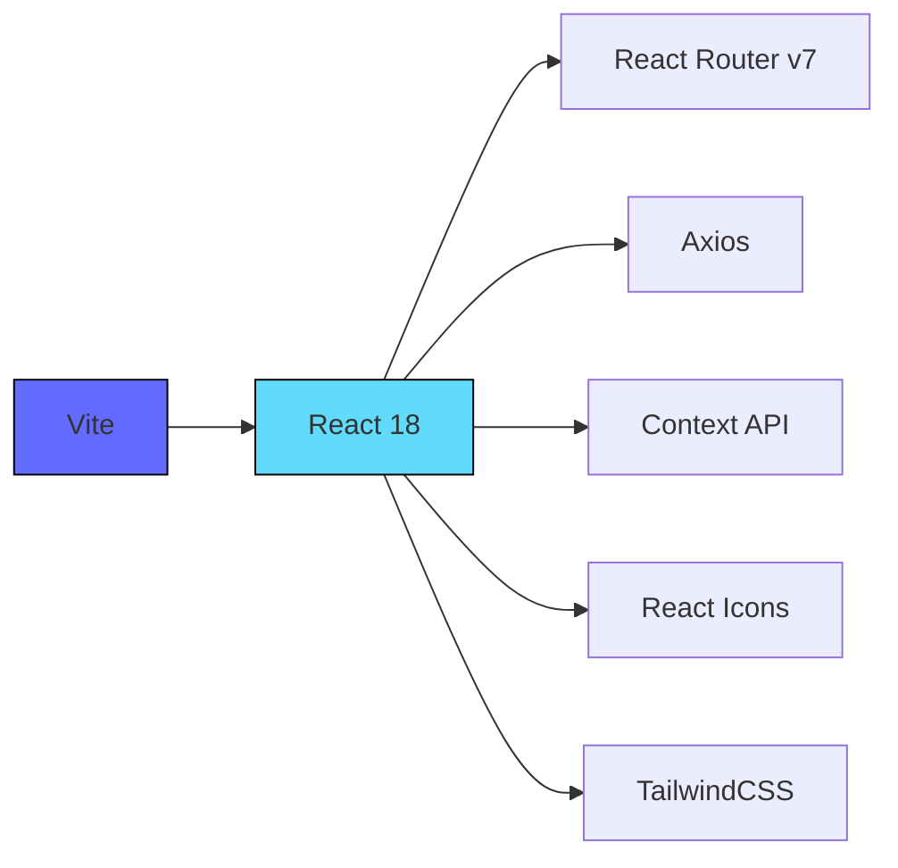
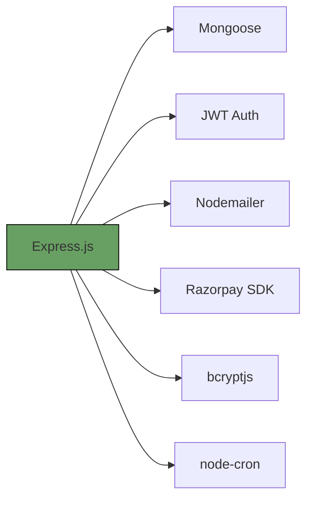
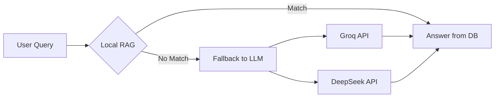

# 🛍️ ShopSphere — Full Stack eCommerce Platform(https://shop-sphere-eta-sand.vercel.app/)

> **Production-ready eCommerce solution** featuring secure authentication, AI-powered support(not added yet), and a full admin panel.
> Developed by **Astik Shah** using React, Node.js, and MongoDB.

---

<div align="center">

[](https://react.dev/)
[](https://nodejs.org/)
[](https://www.mongodb.com/)
[](./LICENSE)

</div>

---

## 🌟 Key Features

| Feature                | Description                                 | Tech Used                             |
| ---------------------- | ------------------------------------------- | ------------------------------------- |
| **🔐 Auth System**     | Email OTP, JWT, refresh token rotation      | JWT, bcrypt, Nodemailer               |
| **🛒 Cart & Checkout** | Smart cart with per-item shipping & fees    | React Context, MongoDB                |
| **💳 Payments**        | Stripe payment                              | Stripe                |
| **📊 Admin Panel**     | Manage users, orders, products              | React, Mongoose                       |
| **🤖 AI Chatbot**      | RAG-based AI assistant with fallback to LLM | Groq,                   |
| **⏳ Auto Cleanup**     | Cron jobs to remove stale/unverified data   | node-cron                             |
| **🔒 Security**        | RBAC, rate limiting, input sanitization     | Helmet, validator, express-rate-limit |

---

## 📚 Documentation Index

| Document              | Description                      | Link                                             |
| --------------------- | -------------------------------- | ------------------------------------------------ |
| **System Overview**   | Architecture & modules           | [`overview.md`](./overview.md)                   |
| **API Reference**     | Full route docs                  | [`api-routes.md`](./api/api-routes.md)               |
| **Database Schema**   | Mongoose schemas                 | [`db-schema.md`](./db-schema)                 |
| **Workflow Diagram**  | Visual flow of app               | [`workflow.md`](./workflows.md)                   |
| **Middleware Guide**  | Auth, RBAC, optional login, etc. | [`middleware.md`](./middleware.md)               |
| **Frontend Packages** | React dependency list            | [`packages-frontend.md`](./packages/frontend.md) |
| **Backend Packages**  | Node.js dependency list          | [`packages-backend.md`](./packages/backend.md)   |

---

## 🚀 Tech Stack

### Frontend (React + Vite)



### Backend (Node.js)



---

## ⚙️ Setup Guide

### 1. Clone Repositories

```bash
# Frontend
git clone https://github.com/your-repo/ecommerce-frontend.git
cd ecommerce-frontend

# Backend
git clone https://github.com/your-repo/ecommerce-backend.git
cd ecommerce-backend
```

### 2. Configure Environment

**.env (Backend)**

```env
MONGODB_URI=mongodb://localhost:27017/shopsphere
JWT_SECRET=your_secure_jwt_secret
RAZORPAY_KEY_ID=rzp_test_xxxxxxxx
RAZORPAY_KEY_SECRET=xxxxxxxxxxxxxxxx
EMAIL_USER=your@email.com
EMAIL_PASS=app_password
```

**.env (Frontend)**

```env
VITE_API_BASE_URL=http://localhost:5000/api
VITE_RAZORPAY_KEY_ID=rzp_test_xxxxxxxx
```

### 3. Install Dependencies & Start

```bash
# Backend
npm install
npm run dev

# Frontend
npm install
npm run dev
```

### 4. Seed Initial Data

```bash
# Run MongoDB seed script
npm run seed
```

---

## 🤖 AI Chatbot Flow



---

## 🔐 Security Overview

| Layer                | Technique                       | Tools Used               |
| -------------------- | ------------------------------- | ------------------------ |
| **Auth**             | JWT + Refresh token rotation    | HTTP-only cookies        |
| **Input Validation** | Sanitize & validate user input  | validator, sanitize-html |
| **Access Control**   | Role-based authorization (RBAC) | Middleware               |
| **Rate Limiting**    | Prevent brute-force attacks     | express-rate-limit       |
| **Hashing**          | Password encryption             | bcrypt (12 salt rounds)  |
| **Email Security**   | Time-sensitive OTP verification | Nodemailer, token expiry |

---


---

## ✨ Connect

[](https://www.linkedin.com/in/astik-shah-04aa46344/)


> For educational and portfolio use only.
