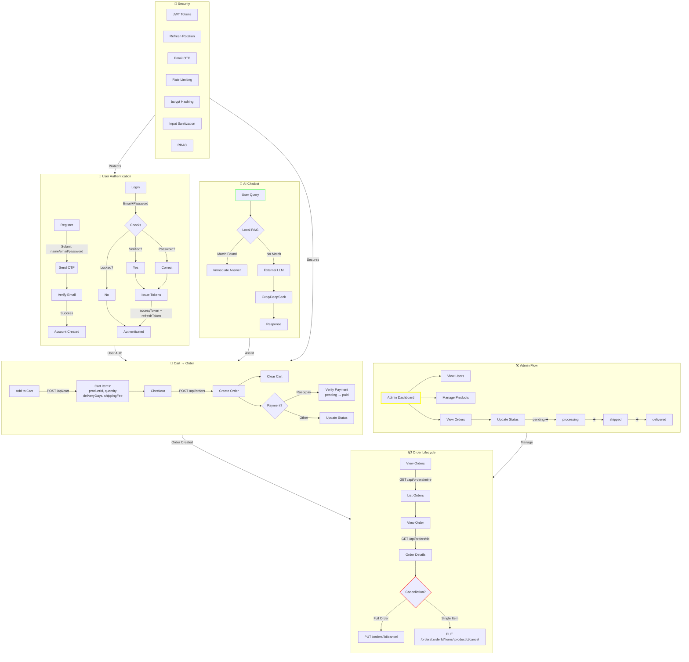

# 🔄 ShopSphere Workflow Diagram

This document visualizes the core logic and flows behind the ShopSphere platform — from user authentication to order lifecycle, admin operations, chatbot assistance, and security layers.

---

## 🧩 Full System Flowchart



---

## 🧠 Notes

- 📍 **Red stroke** on cancellation = critical path
- 💛 **Yellow stroke** on Admin = privileged access
- ✅ Chatbot is marked green as entry point for support

---
> Maintained by **Astik Shah**
🧭 **Back to Index** → [index.md](./index.md)
````


